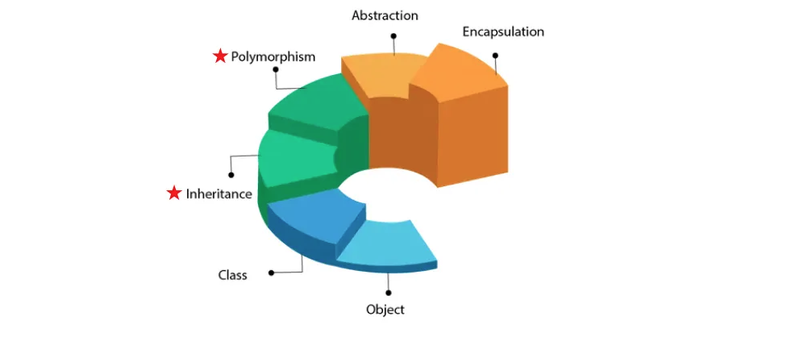

# Week 1 - Introduction

## Praktek

```java
//code snippet
public class Hello {
   public static void main(String[] args) {
      System.out.print("Hello World");
   }
}
```

- Compile, type in terminal `javac src/<filename.java>`
- Run, type in terminal `java <classname>`

## Teori



#### Paradigma Pemrograman

1.  Functional Programming
2.  Procedural Programming (C, Pascal, Fortran)
3.  Object Oriented Programming (Python, Java, JavaScript, C++)

#### Why use PBO ?

1. Reliable
2. Reusable
3. Maintainable

#### OOP - Objet Oriented Programming

1. **Object**, membungkus data dan fungsi, ini menjadikan sudut pandang tersempit dalam OOP. Object tidak boleh bias dan harus spesifik, object juga representasi nyata dari `Class`
2. **Class**, secara umum adalah abstraksi dari kumpulan Object. namun Class ini seperti sebuah mouse, dimana memiliki behaviour di setiap jenisnya.
   ```java
   public class BaseClass{
    ...
   }
   ```
3. **Inheritance**, artinya memiliki konsep parent dan child classes method yang memberikan _reusability_.
   ```java
   public class BaseClass{
    ...
   }
   public class Laptop extends BaseClass{
    ...
   }
   ```
4. **Polymorphism**, artinya adalah '_one function, multiple forms_' yanag membuat Object dapat menentukan method dari fungsi yang akan diimplementasikan. Terdapat overloading dan overriding[^6].

   - Overriding

     ```java
       public class dog{
           public class bark(int num){ // nama dan method sama
                print("woof")
           }
       }

       class bulldog extends dog{
             public class bark(int num){
                print("woof")
           }
       }

     ```

   - Overloading

     ```java
       public class dog{
           public class bark(){ // nama dan method beda
                print("woof")
           }
           public class bark(int num){ // method beda
                print("woof")
           }
           public class bark(char name){ // method beda
                print("woof")
           }
       }

     ```

5. **Abstraction**, dimana kita melihat object secara umum atau lebih sederhana. Juga menyembunyikan detail implemenetasi yang kompleks.
6. **Encapsulation**, memproteksi suatu proses dari interferensi luar sistem.

#### Modularity

Yang menjadikan pemrograman OOP ini solid adalah modularity dimana kita bisa memaintain suatu Struktur secara modular atau terpisah-pisah, hal ini mengurangi waktu development. Layaknya _behaviour_ karakter dan bola yang bisa di maintain secara terpisah.

## Keynote

1. Ketika kita menggunakan `public class` di dalam file, maka penamaan file dan penamaan `class` harus dengan huruf kapital karena java mengikuti aturan PascalCase[^1]. Jika tidak ada public class maka **penamaan file bebas**. [Baca Ini](https://www.freecodecamp.org/news/snake-case-vs-camel-case-vs-pascal-case-vs-kebab-case-whats-the-difference/) untuk mengerti perbedaan casing dalam penamaan suatu objek.

2. Package[^2] bisa dibilang ini adalah 'folder' dalam project java, jika dalam bahasa singkatnya adalah
   `./university/student` = `package university.student;` - `package` berbeda dengan `import`. Perbedaan Package dan Import[^3].

3. `main()` adalah kode titik awal kode java di eksekusi, sebuah file bisa tidak memiliki main, namun jika ingin menjalankannya perlu memanggil file tersebut di file lain yang memiliki `main()`. Lihat jenis-jenis Access Modifier disini [^4].

4. `print` vs `println`[^5].

5. static adalah keyword dalam Java yang mengikat variabel, method, atau class ke class itu sendiri, bukan ke objeknya. Bisa dipanggil tanpa membuat objek, Hanya ada satu salinan dalam memory (shared oleh semua objek), Tidak bisa mengakses non-static variabel/method langsung

6. void sebuah fungsi yang tidak mengembalikan nilai atau return.

# Week 2 - Create Object and Create Function

Objek adalah bagian kecil dari sebuah kelas, sehingga dapat disimpulkan bahwa kelas adalah kumpulan dari beberapa objek yang secara bersama membangun sebuah kelas itu sendiri.

## Praktek

## Teori

# Week 3 - Create Object and Create Function

Objek adalah bagian kecil dari sebuah kelas, sehingga dapat disimpulkan bahwa kelas adalah kumpulan dari beberapa objek yang secara bersama membangun sebuah kelas itu sendiri.

## Praktek

## Teori

# Week 4 - Array

Array mampu menyimpan nilai banyak, namun memakai index yang berupa string.

Array sebenarnya adalah objek dari sebuah tipe data.

jadi kita bisa mengetahui lenght dari sebuah array dengan <array>.lenght

## Praktek
Membuat 2 file, Mainquiz.java dan Quiz.java, dimana Mainquiz.java sebagai main yang nantinya akan memanggil Quiz.java yang isinya adalah method seperti getQuestion dan checkAnswer. 

Nanti kita memanggil pertanyaan dengan looping di dalam main.
## Teori


# Week 5
--empty

# Week 6 - Inheritence
inheritence adalah sebuah cara dalam memprogram OOP yang mana akan mewariskan atribut dan method dari satu kelas ke kelas lain, nanitnya kita memiliki superclass dan subclass

### Footnote

[^1]: Every word starts with an uppercase **letter**
[^2]: Package adalah cara untuk mengelompokkan class dan interface dalam folder yang terstruktur.
[^3]: Perbedaan Package dan Import

    | package                                               | import                                                 |
    | ----------------------------------------------------- | ------------------------------------------------------ |
    | Menentukan di mana file Java berada (seperti folder). | Mengambil class dari package lain agar bisa digunakan. |
    | tidak bisa mengimpor kelas                            | mampu mengimpor kelas                                  |
    | `package university.student;`                         | `import university.teacher.Teacher;`                   |

[^4]: Jenis-jenis Access Modifier

    | Modifier                 | Aksesibilitas                                                    | Example               |
    | ------------------------ | ---------------------------------------------------------------- | --------------------- |
    | `public`                 | Dari mana saja                                                   | `public int data`     |
    | `private`                | Hanya dalam class itu sendiri                                    | `private int data`    |
    | `protected`              | Dalam class sendiri + subclass (inheritance) + package yang sama | `protected int data;` |
    | default (tanpa modifier) | Dalam class sendiri + subclass (inheritance) + package yang sama | `int data;`           |

[^5]: print vs println

    | Method      | Baris Baru Setelah Cetak? | Output Berikutnya Muncul di? |
    | ----------- | ------------------------- | ---------------------------- |
    | `print()`   | ❌ Tidak                  | Baris yang sama              |
    | `println()` | ✅ Ya                     | Baris berikutnya             |

[^6]: Overriding vs Overloading

    | Overloading                                       | Overriding                                  |
    | ------------------------------------------------- | ------------------------------------------- |
    | runtime polymorphism                              | compile time polymorphism                   |
    | Terjdai di dalam class itu sendiri                | terjadi di superclass(parent) atau subclass |
    | memiliki nama yang sama namun method yang berbeda | nama dan method yang sama                   |
